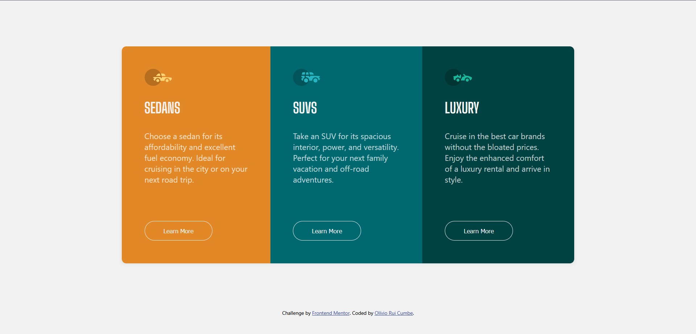

# Frontend Mentor - 3-Column Preview Card Component Solution

This is a solution to the [3-Column Preview Card Component challenge on Frontend Mentor](https://www.frontendmentor.io/challenges/3column-preview-card-component-pH92eAR2-). Frontend Mentor challenges help you improve your coding skills by building realistic projects.

## Table of contents

- [Overview](#overview)
  - [The challenge](#the-challenge)
  - [Screenshot](#screenshot)
  - [Links](#links)
- [My process](#my-process)
  - [Built with](#built-with)
  - [What I learned](#what-i-learned)
  - [Continued development](#continued-development)
  - [Useful resources](#useful-resources)
- [Author](#author)
- [Acknowledgments](#acknowledgments)

## Overview

### The challenge

Users should be able to:

- View the optimal layout for the site depending on their device's screen size
- See hover states for all interactive elements on the page

### Screenshot



### Links

- Solution URL: [Solution URL](https://www.frontendmentor.io/solutions/3-column-preview-card-component-0sCNCChJaS)
- Live Site URL: [Live site URL](https://oliviorui.github.io/practice-projects/html-css/3-column-preview-card-component/index.html)

## My process

### Built with

- Semantic HTML5 markup
- CSS custom properties
- Flexbox
- Mobile-first workflow

### What I learned

During this project, I practiced working with **Flexbox** to structure the layout and **CSS custom properties** to maintain consistent styling. One of the things I implemented was a hover effect that adds a subtle transformation:

```css
.anime:hover {
    transform: scale(1.05);
    transition: 0.5s;
    border-radius: 25px;
}
```

### Continued development

In future projects, I want to focus more on improving responsiveness using **CSS Grid** and experimenting with **SASS** to make styling more scalable.

### Useful resources

- [CSS Tricks - Flexbox Guide](https://css-tricks.com/snippets/css/a-guide-to-flexbox/) - Helped in structuring the layout effectively.
- [MDN Web Docs - CSS transitions](https://developer.mozilla.org/en-US/docs/Web/CSS/CSS_Transitions/Using_CSS_transitions) - Used for smooth hover effects.

## Author

- Frontend Mentor - [@oliviorui](https://www.frontendmentor.io/profile/oliviorui)

## Acknowledgments

Special thanks to the Frontend Mentor community for the inspiration and learning resources.