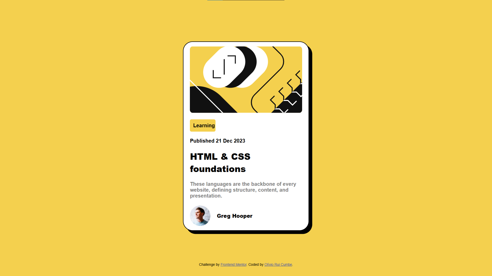

# Frontend Mentor - Blog Preview Card Solution

This is a solution to the [Blog Preview Card challenge on Frontend Mentor](https://www.frontendmentor.io/challenges/blog-preview-card-8J5glGxIH). Frontend Mentor challenges help you improve your coding skills by building realistic projects.

## Table of contents

- [Overview](#overview)
  - [The challenge](#the-challenge)
  - [Screenshot](#screenshot)
  - [Links](#links)
- [My process](#my-process)
  - [Built with](#built-with)
  - [What I learned](#what-i-learned)
  - [Continued development](#continued-development)
  - [Useful resources](#useful-resources)
- [Author](#author)
- [Acknowledgments](#acknowledgments)

## Overview

### The challenge

Users should be able to:

- View the optimal layout for the site depending on their device's screen size
- See hover states for interactive elements, such as the blog title

### Screenshot



### Links

- Solution URL: [https://www.frontendmentor.io/solutions/carto-de-pr-visualizao-do-blog-r17ae_a-oF](https://www.frontendmentor.io/solutions/carto-de-pr-visualizao-do-blog-r17ae_a-oF)
- Live Site URL: [https://oliviorui.github.io/practice-projects/html-css/blog-preview-card/index.html](https://oliviorui.github.io/practice-projects/html-css/blog-preview-card/index.html)

## My process

### Built with

- Semantic HTML5 markup
- Flexbox
- Mobile-first workflow

### What I learned

This project taught me the importance of layout consistency with **Flexbox** and the effective use of custom fonts. I also worked on creating clean hover effects for interactive elements like the blog title:

```css
h1:hover { 
    color: hsl(47, 88%, 63%);
    cursor: pointer;
}
```

### Continued development

For future projects, I want to experiment more with **CSS Grid** for layout control and improve my understanding of accessibility practices for creating better user experiences.

### Useful resources

- [CSS-Tricks - Flexbox Guide](https://css-tricks.com/snippets/css/a-guide-to-flexbox/) - Helped me with Flexbox layout for this project.
- [MDN Web Docs - CSS hover effect](https://developer.mozilla.org/en-US/docs/Web/CSS/:hover) - Gave me a better understanding of how to implement hover effects in a clean way.

## Author

- Frontend Mentor - [@oliviorui](https://www.frontendmentor.io/profile/oliviorui)

## Acknowledgments

Shoutout to the Frontend Mentor community for providing valuable feedback and resources during this challenge.