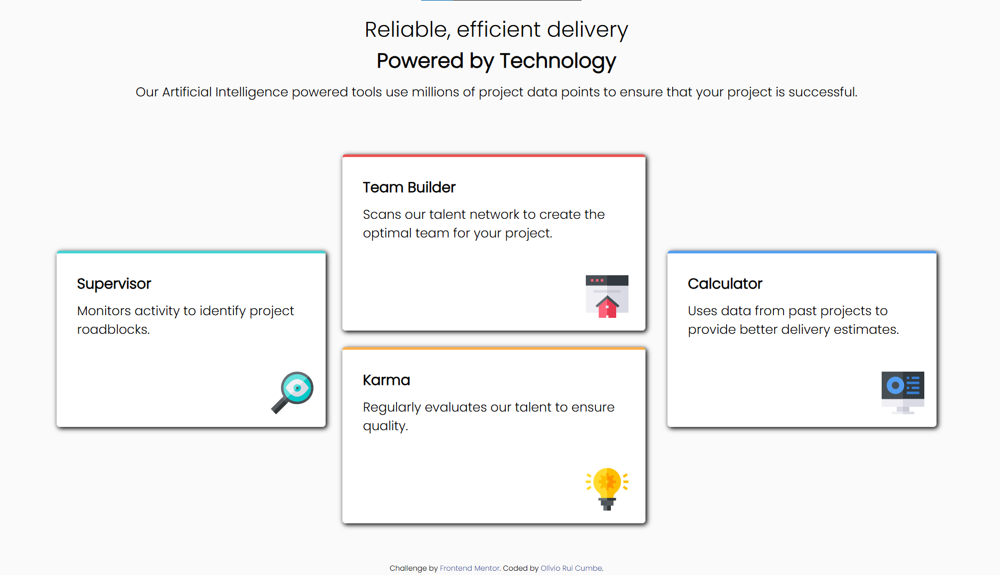

# Frontend Mentor - Four Card Feature Section Solution

This is a solution to the [Four Card Feature Section challenge on Frontend Mentor](https://www.frontendmentor.io/challenges/four-card-feature-section-weK1eFYK). Frontend Mentor challenges help you improve your coding skills by building realistic projects.

## Table of contents

- [Overview](#overview)
  - [The challenge](#the-challenge)
  - [Screenshot](#screenshot)
  - [Links](#links)
- [My process](#my-process)
  - [Built with](#built-with)
  - [What I learned](#what-i-learned)
  - [Continued development](#continued-development)
  - [Useful resources](#useful-resources)
- [Author](#author)
- [Acknowledgments](#acknowledgments)

## Overview

### The challenge

Users should be able to:

- View the optimal layout for the component depending on their device's screen size

### Screenshot



### Links

- Solution URL: [https://www.frontendmentor.io/solutions/four-card-feature-section-ygh8C5MVKv](https://www.frontendmentor.io/solutions/four-card-feature-section-ygh8C5MVKv)
- Live Site URL: [https://oliviorui.github.io/practice-projects/html-css/four-card-feature-section/index.html](https://oliviorui.github.io/practice-projects/html-css/four-card-feature-section/index.html)

## My process

### Built with

- Semantic HTML5 markup
- CSS Flexbox
- Mobile-first workflow
- Custom fonts with `@font-face`

### What I learned

This project helped me improve my **CSS layout skills**, especially working with **Flexbox** to structure components in different screen sizes.

One of the main challenges was organizing the **cards** in a structured and responsive way:

```css
.blocks, .central-blocks {
    display: flex;
    flex-direction: column;
    gap: 25px;
}

@media (min-width: 1000px) {
    .blocks { 
        flex-direction: row; 
        align-items: center;
    }
}
```

Additionally, I implemented a **hover effect** on the attribution link:

```css
.attribution a { 
    color: hsl(228, 45%, 44%); 
    text-decoration: none; 
}

.attribution a:hover { 
    text-decoration: underline; 
}
```

### Continued development

Moving forward, I want to:

- Improve **hover effects** and animations for better user interaction
- Optimize **font sizes and spacing** for better readability on different screen sizes
- Explore **CSS Grid** for more complex layouts

### Useful resources

- [CSS Tricks - A Complete Guide to Flexbox](https://css-tricks.com/snippets/css/a-guide-to-flexbox/) - Helped me structure the layout efficiently.
- [MDN Web Docs - Responsive Design](https://developer.mozilla.org/en-US/docs/Learn/CSS/CSS_layout/Responsive_Design) - A great reference for making sites mobile-friendly.

## Author

- Frontend Mentor - [@oliviorui](https://www.frontendmentor.io/profile/oliviorui)

## Acknowledgments

Thanks to the Frontend Mentor community for the support and feedback!