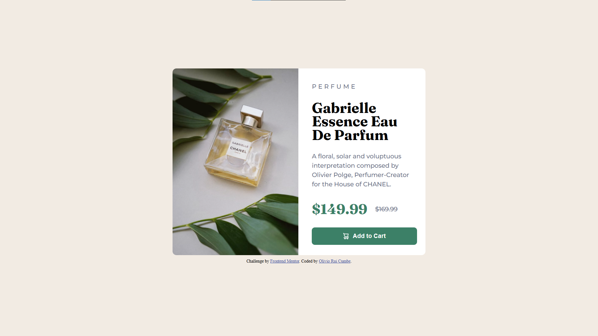

# Frontend Mentor - Product Preview Card Component Solution

This is a solution to the [Product Preview Card Component challenge on Frontend Mentor](https://www.frontendmentor.io/challenges/product-preview-card-component-GO7UmttRfa). Frontend Mentor challenges help you improve your coding skills by building realistic projects.

## Table of contents

- [Overview](#overview)
  - [The challenge](#the-challenge)
  - [Screenshot](#screenshot)
  - [Links](#links)
- [My process](#my-process)
  - [Built with](#built-with)
  - [What I learned](#what-i-learned)
  - [Continued development](#continued-development)
  - [Useful resources](#useful-resources)
- [Author](#author)
- [Acknowledgments](#acknowledgments)

## Overview

### The challenge

Users should be able to:

- View the optimal layout for the product card depending on their device's screen size
- See hover and focus states for interactive elements

### Screenshot



### Links

- Solution URL: [https://www.frontendmentor.io/solutions/product-preview-card-component-LBzg1EK-VX](https://www.frontendmentor.io/solutions/product-preview-card-component-LBzg1EK-VX)
- Live Site URL: [https://oliviorui.github.io/practice-projects/html-css/product-preview-card-component/index.html](https://oliviorui.github.io/practice-projects/html-css/product-preview-card-component/index.html)

## My process

### Built with

- Semantic HTML5 markup
- CSS Flexbox
- Mobile-first workflow
- Custom fonts with `@font-face`

### What I learned

This challenge helped me reinforce **responsive design techniques** and **typography styling**.  
One of the key aspects was switching between **mobile and desktop images** based on screen width:

```css
#desktop-img {
    display: none;
}

@media (min-width: 1280px) {
    #mobile-img { display: none; }
    #desktop-img { display: block; }
}
```

I also improved my **button hover effect**, making it more interactive:

```css
button {
    background-color: hsl(158, 36%, 37%);
    transition: .3s ease-in-out;
}

button:hover {
    background-color: hsl(158, 42%, 18%);
}
```

### Continued development

I plan to continue improving:

- Accessibility (ARIA labels and better focus handling)
- Enhancing animations and transitions for a smoother UI experience
- Experimenting with **CSS Grid** for alternative layouts

### Useful resources

- [CSS Tricks - Flexbox Guide](https://css-tricks.com/snippets/css/a-guide-to-flexbox/) - Helped structure the layout effectively.
- [MDN Web Docs - Responsive Images](https://developer.mozilla.org/en-US/docs/Learn/HTML/Multimedia_and_embedding/Responsive_images) - Great reference for handling different image sizes.

## Author

- Frontend Mentor - [@oliviorui](https://www.frontendmentor.io/profile/oliviorui)

## Acknowledgments

Thanks to the Frontend Mentor community for the challenges and inspiration!